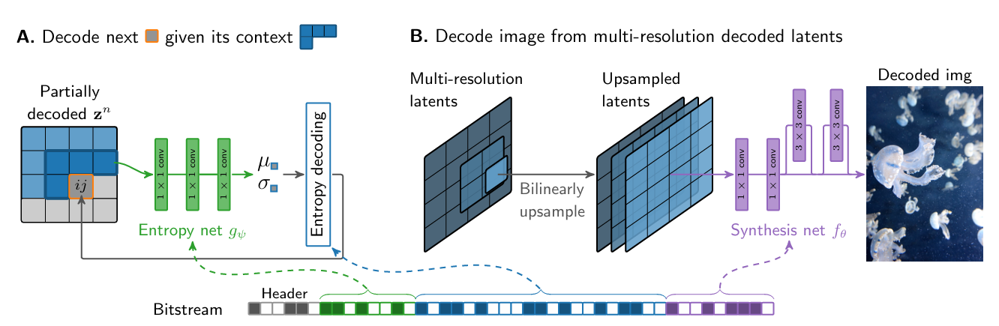
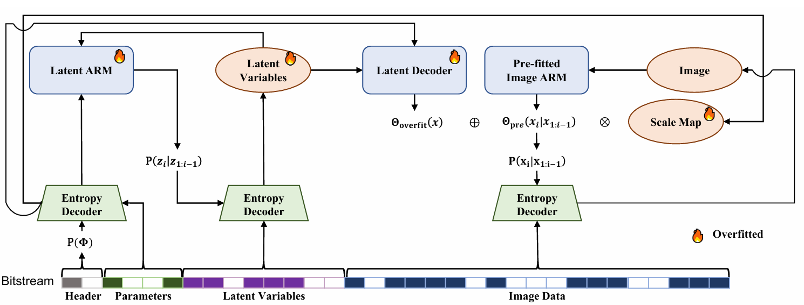
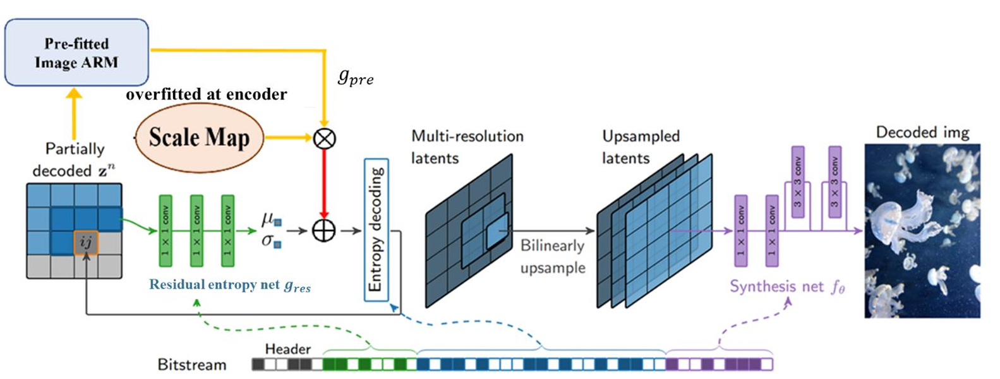

# 視訊處理 final project
組員:  黃程榆, 林芷萱, 吳柏翰

***報告在report資料夾裡***

---

# 架構圖

本project參考:
1. H. Kim, M. Bauer, L. Theis, J. R. Schwarz and E. Dupont, "C3: High-Performance and Low-Complexity Neural ompression from a Single Image or Video," 2024 IEEE/CVF Conference on Computer Vision and Pattern Recognition (CVPR), Seattle, WA, USA, 2024, pp. 9347-9358, doi: 10.1109/CVPR52733.2024.00893. github: https://github.com/google-deepmind/c3_neural_compression.git
2. Z. Zhang, Z. Chen and S. Liu, "Fitted Neural Lossless Image Compression," 2025 IEEE/CVF Conference on Computer Vision and Pattern Recognition (CVPR), Nashville, TN, USA, 2025, pp. 23249-23258, doi: 10.1109/CVPR52734.2025.02165. github: https://github.com/ZZ022/FNLIC.git

C3[1]架構圖:

FNLIC[2]架構圖:


---

我們提出的架構圖:


---

# setup

```
pip install -r requirements.txt
python setup.py install
```

# Run experiments

Hybrid experiment
```
python run_hybrid_experiment.py
```

Rd experiment
```
python run_rd_experiment.py
```